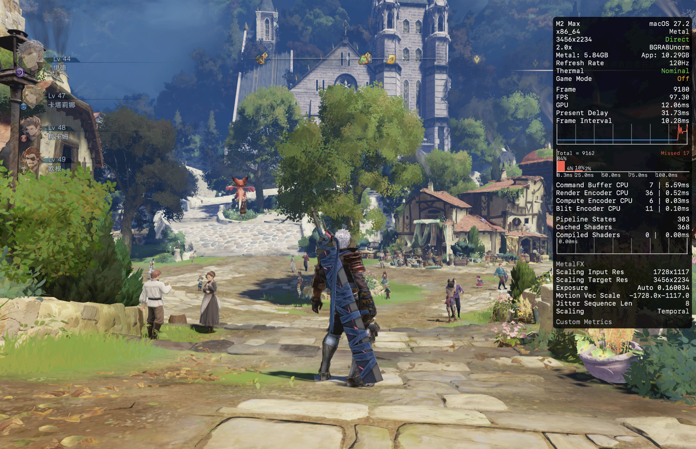

# GBFR MetalFX + 宽屏一键工具

[](https://github.com/aiwentongxue/GBFR-MetalFX-CrossOver-Toolkit/releases/latest)


面向 Apple Silicon Mac + CrossOver/DXMT 的《碧蓝幻想 Relink》非官方辅助工具。它将 MetalFX Temporal、Direct 呈现路径和 GBFRelinkFix 宽屏补丁整合为一个可交互安装脚本。



## 功能

- 一键安装/修复 MetalFX Temporal + 绿色 `Direct`。
- 集成 Lyall 的 `GBFRelinkFix v1.1.5`，支持自定义分辨率和超宽屏。
- 可选 50%、60%、65%、75%、85% 和 100% MetalFX 渲染比例。
- 自动写入并验证游戏专用 Wine DLL 覆盖。
- 支持 Metal HUD 开关、配置诊断、安装前备份和恢复。
- 不修改游戏 EXE。

## 已验证环境

- Apple Silicon Mac（实测 M2 Max）
- CrossOver Preview 0821
- DXMT 图形后端
- Steam App ID `881020`
- Steam Build ID `24955526`
- 3456×2234 目标分辨率
- MetalFX 50%：1728×1117 → 3456×2234

## 下载

请按需求选择版本：

| 版本 | 适合用户 | 下载 |
|---|---|---|
| v1.1.0 | 需要 MetalFX，同时需要宽屏/自定义分辨率（推荐） | [GBFR-MetalFX-Ultrawide-Tool-v1.1.0.zip](https://github.com/aiwentongxue/GBFR-MetalFX-CrossOver-Toolkit/releases/download/v1.1.0/GBFR-MetalFX-Ultrawide-Tool-v1.1.0.zip) |
| v1.0.0 | 只需要 MetalFX Direct，不需要任何分辨率适配 | [GBFR-MetalFX-Direct-Tool-v1.0.0.zip](https://github.com/aiwentongxue/GBFR-MetalFX-CrossOver-Toolkit/releases/download/v1.0.0/GBFR-MetalFX-Direct-Tool-v1.0.0.zip) |

如果 v1.1.0 的宽屏补丁与新游戏版本不兼容，可回退到 v1.0.0。

请不要只下载或复制单个 `.command` 文件，安装脚本需要同目录中的 `payload` 文件。

## 小白安装

1. 完全退出《碧蓝幻想 Relink》。
2. 解压 Release 中的 ZIP。
3. 双击 `GBFR MetalFX + 宽屏一键工具.command`。
4. 选择 `1) 一键推荐安装 / 修复`。
5. 选择游戏目录和实际用来启动游戏的 CrossOver 容器。
6. 在 CrossOver 的容器设置里开启“高分辨率模式”，然后启动游戏。

如果 macOS 拦截脚本，请右键 `.command` 文件并选择“打开”。

更详细的说明见 [新手安装教程](docs/新手安装教程.md) 和 [MetalFX 档位调节教程](docs/MetalFX-档位调节教程.md)。

## 如何确认已生效

Metal HUD 右上角应同时显示：

- 绿色 `Direct`
- `MetalFX`
- `Scaling: Temporal`
- `Scaling Input Res` 小于 `Scaling Target Res`

只看到 DLL 已加载或开关已打开，不等于 MetalFX 已经实际运行；请以 Metal HUD 数据为准。

## 换容器后画面异常

CrossOver 环境变量和 DLL 覆盖是按容器分开保存的。换容器后，需要重新运行工具并选择新容器。

工具会为 `granblue_fantasy_relink.exe` 写入：

```text
dxgi    = native,builtin
nvapi64 =
nvngx   = builtin
winmm   = native,builtin
```

其中禁用 DXMT `nvapi64.dll` 是为了避开当前未实现的 NvAPI 间接绘制路径，该问题可能造成人物和大部分场景不渲染。

## 重要限制

- 当前默认是 `SDR + MetalFX + Direct`，不提供 HDR。
- 已测试环境中，Luma scRGB HDR 会让呈现路径转为黄色 `Composited`。
- 游戏、CrossOver、DXMT、Luma 或 ReShade 更新后都可能需要重新适配。
- 本项目不包含任何游戏文件，与 Cygames、Steam、Apple 或 CodeWeavers 无官方关联。

## 开源项目与许可

- [Luma Framework](https://github.com/Filoppi/Luma-Framework) — 自定义 MIT 许可；商业使用需先获得原作者许可。
- [ReShade](https://github.com/crosire/reshade) — BSD 3-Clause 风格许可。
- [GBFRelinkFix](https://github.com/Lyall/GBFRelinkFix) — MIT License，原作者 Lyall。
- 本工具的安装脚本使用 MIT License。

完整许可证位于 [`licenses`](licenses/) 目录，第三方声明见 [THIRD_PARTY_NOTICES.md](THIRD_PARTY_NOTICES.md)。

## 发布校验

ZIP SHA-256：

```text
15d4757769016aac8fa52a361282b8b325bc3ea124897617315511dff8937c2e  GBFR-MetalFX-Direct-Tool-v1.0.0.zip
56eceb53d76871c825813c67293512ee175809f564d1d1b76675722a6de8db34  GBFR-MetalFX-Ultrawide-Tool-v1.1.0.zip
```

## 反馈问题

提交 Issue 时请附上：macOS 版本、Mac 芯片、CrossOver 版本、游戏 Build ID、Metal HUD 截图和相关 `.cxlog`。
